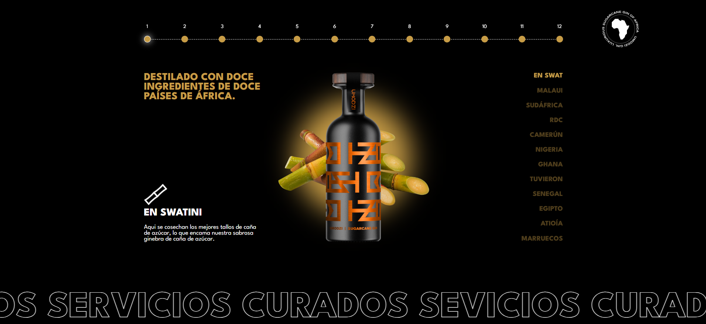

# 🍸 Ginebra - Frontend & Animation Practice

## 📝 Project Description
This project is an **advanced Frontend development and interactive animation practice**. The main goal was to replicate and experiment with the premium aesthetics and fluid interactions of a luxury brand website (Ginebra Unidad).

> [!IMPORTANT]
> **Purpose Disclaimer:** This repository is exclusively for **practice, study, and personal portfolio** purposes. It is not an official site and is not intended for commercial use.

## ✨ Key Features
- **Custom Cursor:** Dynamic mouse interaction that changes scale and style when interacting with elements.
- **Interactive Sliders:** Implementation of custom vertical and horizontal sliders controlled via JavaScript.
- **Fluid Transitions:** Entry and exit animations for menus and sections using CSS3 and Vanilla JS.
- **Premium Design:** Focus on high-quality typography, whitespace, and visual elements.
- **Responsive Design:** Adaptability for different screen sizes (optimization in progress).

## 🛠️ Tech Stack
- **HTML5:** Full semantic structure.
- **CSS3 (Vanilla):** Visual design, Flexbox, Grid, and transition animations.
- **JavaScript (Vanilla):** Interactivity logic, DOM manipulation, and slider control.

## 🎨 Credits and Acknowledgments
The original design, visual assets (images, videos, logos), and brand concept belong to the official website of **Unit Gin (Ginebra Unidad)**.

- **Inspirational Official Website:** [Unit Gin](https://unit-gin.com/)
- **Practice Development:** [Sebastian Vasquez](https://github.com/sebastianvasquezechavarria1234)

---
*Made with ❤️ to enhance web animation skills.*
